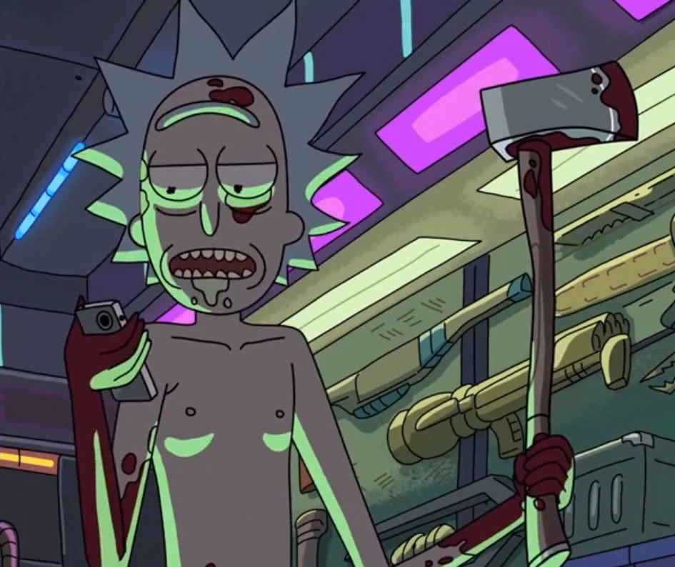
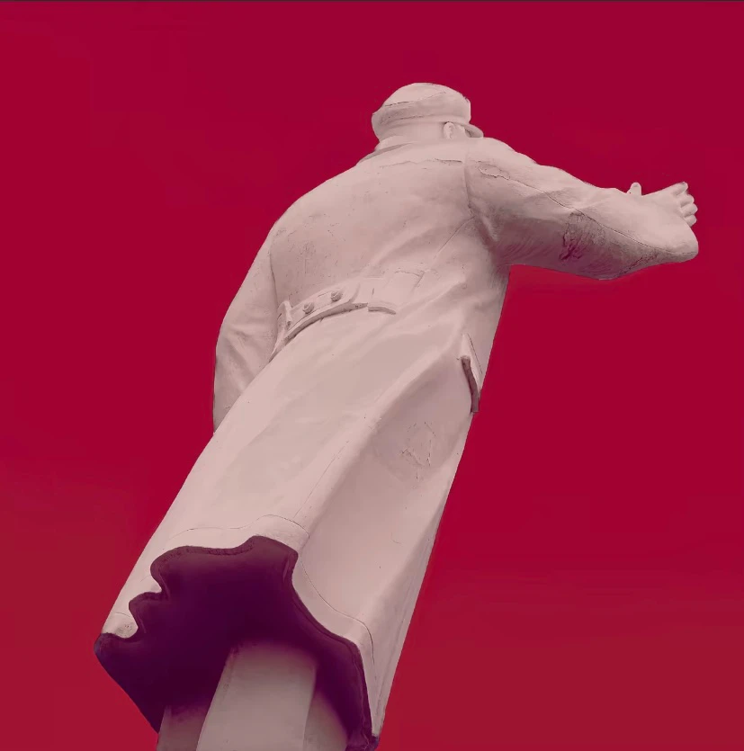

  
  <h1>北原慢热</h1>
  
<i>「我们吞咽了太多意义，其实生命只需要呼吸」</i>

---

### 我是谁

哲学写作者，《生命论（明本论）》作者。从"在感"出发，推导出人的解放何以可能。

感先于操作，操作先于实体；自指操作即生命；知道怎么反自指，才知道怎么正自指。

### 在做什么

📚 **[生命论（明本论）](https://github.com/192781-li/mingbenlun)** — 从本体论到价值论到实践论的完整哲学体系，用Coq和线性逻辑做数学形式化。

- 12卷结构：存在论→操作论→认识论→实践论→群己论→异化论→解放论→格物论→人文论→传统论→践演论（数学形式化）→附录
- 核心命题：操作先于实体、自指即生命S=f(S)、异化是自指的丧失、解放是恢复自指
- 最终目的：找最坚硬的锤头，把无产阶级的锁链砸断，让人人如龙

### 立场

- 人民史观，一切源于人民，大多数人即日常，日常即一切
- 共产主义者，为了全人类的解放而奋斗，为了全人类的明性与进步奋斗
- 一切的奋斗与沉淀都要服务于人民大众
- 生命论的开创者，源于一个中国的劳动者家庭

---

  
  
方向在前方，路在脚下。

  
文史哲 · 革命 · 毛泽东思想

